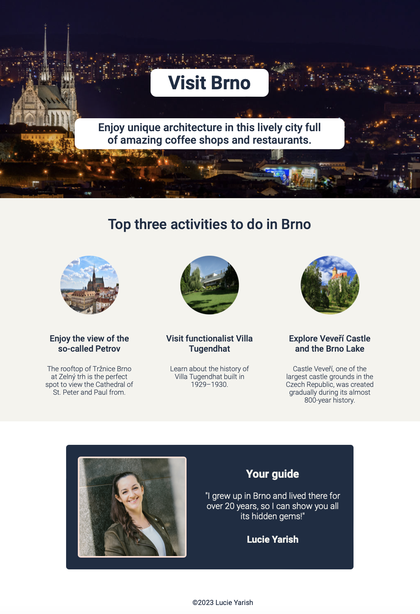

# Hometown Homepage

Capstone project of the web dev basics section of [Scrimba's Front-End Developer Career Path](https://scrimba.com/learn/frontend).

Although [the design created in Figma](http://example.com/) was provided by Scrimba, students are encouraged to build a homepage of their hometown instead and adjust the design to their visual preferences.

Building this hometown homepage solo project was a great way to practice everything I've learned in the web dev basics course section! It took me about 3 hours to complete.

