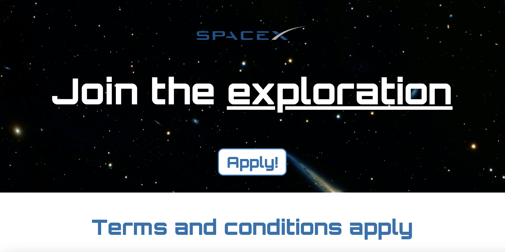

# Space Exploration Site

Another small project built with HTML & CSS only.

Having built this project, I learned/reviewed the following topics:

- Handling background images
- `webp` format
- Google Fonts
- The `span` tag
- IDs & utility classes
- `text-shadow`
